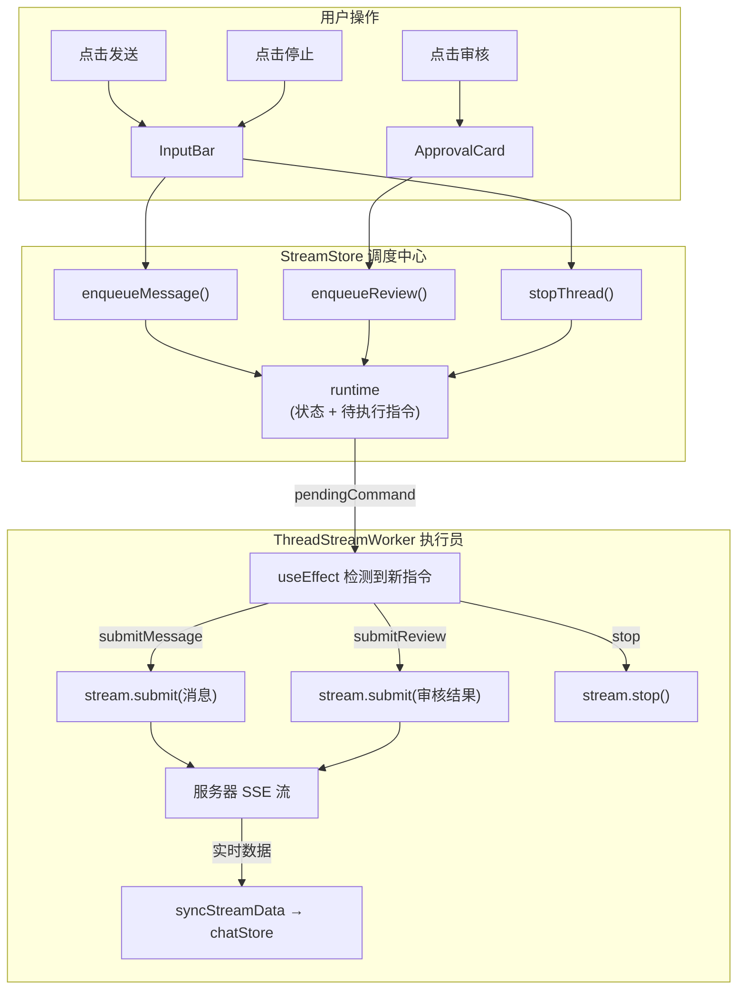

# StreamStore + ThreadStreamWorker 架构解析

## 一句话总结

> **StreamStore 是"调度中心"，ThreadStreamWorker 是"执行员"。** 用户的每个操作（发消息、审核、停止）变成一个"指令"放进调度中心，执行员拿到指令后去跟服务器通信。

---

## 🏗️ 整体架构图



---

## 📦 StreamStore — 调度中心

### 核心概念：Runtime（运行时）

把它想象成**一个"工位"**。每个线程的流式通信需要一个工位来管理：

```
Runtime = {
    workerId: "runtime-1",        // 工位编号
    threadId: "thread-abc",       // 这个工位服务哪个对话
    status: "idle",               // 工位状态
    pendingCommand: null,         // 桌上的待办任务
    lastError: null,              // 最近的错误
}
```

### Runtime 的生命周期

```
                    用户发消息
                        │
                        ▼
    ┌──── idle ────► booting ────► streaming ────► idle ────► 被清除
    │   (空闲)       (启动中)      (流式传输中)    (完成)     (回收)
    │                                  │
    │                                  ▼
    │                             stopping
    │                            (用户点停止)
    │                                  │
    └──────────────────────────────────┘
```

### 两个查找表

StreamStore 用**两张表**管理所有 runtime：

```typescript
// 表1: 线程 → 工位编号（快速查找"这个线程用的哪个工位"）
runtimeIdByThreadKey: {
    "thread-abc": "runtime-1",
    "__draft__":  "runtime-2",   // 新对话还没有 threadId，用占位符
}

// 表2: 工位编号 → 完整工位数据
runtimesById: {
    "runtime-1": { workerId: "runtime-1", threadId: "thread-abc", status: "streaming", ... },
    "runtime-2": { workerId: "runtime-2", threadId: null, status: "booting", ... },
}
```

> [!TIP]
> 为什么不直接用 `threadId` 做 key？因为**新对话还没有 threadId**（要等服务器返回），所以用 `__draft__` 占位。

### 指令系统

用户的每个操作都变成一个**指令对象**，放到 runtime 的 `pendingCommand` 上：

```typescript
// 发消息
{ id: "cmd-1", type: "submitMessage", text: "你好", messageId: "client-xxx" }

// 审核工具调用
{ id: "cmd-2", type: "submitReview", response: { decision: "approve" } }

// 停止
{ id: "cmd-3", type: "stop" }
```

每个指令有唯一 [id](file:///Users/sweetang/Desktop/langchain-tuitor/apps/human-in-the-loop/frontend/components/Chat/Sidebar/index.tsx#9-108)，防止重复执行。

### 关键方法一览

| 方法 | 谁调用 | 做什么 |
|---|---|---|
| [enqueueMessage](file:///Users/sweetang/Desktop/langchain-tuitor/apps/human-in-the-loop/frontend/store/streamStore.ts#116-144) | InputBar | 创建/复用 runtime，放入 submitMessage 指令 |
| [enqueueReview](file:///Users/sweetang/Desktop/langchain-tuitor/apps/human-in-the-loop/frontend/store/streamStore.ts#145-169) | ApprovalCard | 创建/复用 runtime，放入 submitReview 指令 |
| [stopThread](file:///Users/sweetang/Desktop/langchain-tuitor/apps/human-in-the-loop/frontend/store/streamStore.ts#170-196) | InputBar | 放入 stop 指令 |
| [consumePendingCommand](file:///Users/sweetang/Desktop/langchain-tuitor/apps/human-in-the-loop/frontend/store/streamStore.ts#197-215) | ThreadStreamWorker | 标记指令已被取走（清空 pendingCommand） |
| [syncRuntimeLoading](file:///Users/sweetang/Desktop/langchain-tuitor/apps/human-in-the-loop/frontend/store/streamStore.ts#216-257) | ThreadStreamWorker | 根据 stream.isLoading 更新 runtime.status |
| [markRuntimeError](file:///Users/sweetang/Desktop/langchain-tuitor/apps/human-in-the-loop/frontend/store/streamStore.ts#258-278) | ThreadStreamWorker | 记录错误信息 |
| [moveDraftRuntimeToThread](file:///Users/sweetang/Desktop/langchain-tuitor/apps/human-in-the-loop/frontend/store/streamStore.ts#279-311) | ThreadStreamWorker | 新对话获得 threadId 后，把 `__draft__` 改成真实 ID |
| [clearRuntime](file:///Users/sweetang/Desktop/langchain-tuitor/apps/human-in-the-loop/frontend/store/streamStore.ts#322-325) | ThreadStreamWorker | 任务完成后回收工位 |

---

## ⚙️ ThreadStreamWorker — 执行员

这是一个**不渲染任何 UI 的 React 组件**（`return null`），纯粹负责"干活"。

### 它做 5 件事（5 个 useEffect）

````carousel
### 1️⃣ 同步 threadId 到 useStream

```typescript
useEffect(() => {
    if (runtime.threadId === boundThreadId || stream.isLoading) return;
    setBoundThreadId(runtime.threadId);
}, [boundThreadId, runtime, stream.isLoading]);
```

**为什么需要？** `useStream` hook 需要知道跟哪个线程通信。当 runtime 的 threadId 变化时（比如新对话获得了真实 ID），更新给 useStream。

但如果 stream 正在传输中（`isLoading`），就不更新——等当前流结束再说。
<!-- slide -->
### 2️⃣ 同步 stream 数据到 chatStore

```typescript
useEffect(() => {
    syncStreamData(runtime.threadId, {
        messages: stream.messages,
        toolCalls: stream.toolCalls,
        isLoading: stream.isLoading,
        interrupt: stream.interrupt ? { value: ... } : null,
    });
}, [stream.messages, stream.toolCalls, stream.isLoading, stream.interrupt]);
```

**做什么？** 把 `useStream` 返回的实时数据（消息、工具调用、是否加载中、是否中断）写入 chatStore，这样 MessageList 组件就能渲染出来。

这是**数据从服务器到 UI 的桥梁**。
<!-- slide -->
### 3️⃣ 同步 loading 状态到 runtime

```typescript
useEffect(() => {
    syncRuntimeLoading(workerId, stream.isLoading);
}, [stream.isLoading]);
```

**为什么单独同步？** runtime 的 status 需要跟着 stream 的 loading 状态走：
- `stream.isLoading = true` → runtime.status = `"streaming"`
- `stream.isLoading = false`（且之前在 streaming）→ runtime.status = `"idle"`

这样 InputBar 才知道该显示"发送"还是"停止"按钮。
<!-- slide -->
### 4️⃣ 自主执行任务（核心逻辑）

```typescript
useEffect(() => {
    if (!runtime?.pendingCommand) return;
    if (lastExecutedCommandIdRef.current === pendingCommand.id) return; // 防重复

    consumePendingCommand(workerId, pendingCommand.id); // 标记已取走

    switch (pendingCommand.type) {
        case 'submitMessage':
            stream.submit({ messages: [...] });
            break;
        case 'submitReview':
            stream.submit(null, { command: { resume: response } });
            break;
        case 'stop':
            stream.stop();
            break;
    }
}, [runtime, stream]);
```

**这是最关键的逻辑**——检测到 runtime 上有新指令就执行它。用 `lastExecutedCommandIdRef` 防止同一个指令被执行两次。
<!-- slide -->
### 5️⃣ 清除不活跃的 worker

```typescript
useEffect(() => {
    if (runtime?.status !== 'idle') return;
    clearRuntime(workerId); // 回收工位
}, [runtime?.status]);
```

**为什么？** 任务完成后（status 变为 idle），这个 worker 就没用了。调用 `clearRuntime` 把 runtime 从 store 中删除，ChatStreamHub 就不会再渲染这个 ThreadStreamWorker 了。
````

---

## 🔄 完整流程示例

### 用户发送一条消息

```
1. 用户在 InputBar 输入"你好"，按回车
   ↓
2. InputBar 调用 streamStore.enqueueMessage(threadId, "你好", "client-123")
   → 创建 runtime-1，status="booting"，pendingCommand={type:"submitMessage"}
   ↓
3. ChatStreamHub 检测到 runtime-1 (status !== "idle")
   → 渲染 <ThreadStreamWorker workerId="runtime-1" />
   ↓
4. ThreadStreamWorker 的 useEffect#4 检测到 pendingCommand
   → 调用 stream.submit({ messages: [{type:"human", content:"你好"}] })
   → 调用 consumePendingCommand 清空 pendingCommand
   ↓
5. useStream 开始 SSE 连接，stream.isLoading = true
   → useEffect#3: runtime.status 变为 "streaming"
   → useEffect#2: 实时消息同步到 chatStore → MessageList 渲染气泡
   ↓
6. 服务器返回完毕，stream.isLoading = false
   → useEffect#3: runtime.status 变为 "idle"
   → useEffect#5: clearRuntime → runtime 被删除 → Worker 被卸载
   ↓
7. 完成 ✅
```

### 新对话（没有 threadId 的情况）

```
1. 用户在新对话中发消息
   → threadId = null → 用 "__draft__" 作为 key
   → runtime.threadId = null → useStream 的 threadId = null
   ↓
2. 服务器创建新线程，回调 onThreadId("thread-abc")
   → moveDraftSessionToThread: chatStore 的 __draft__ → thread-abc
   → moveDraftRuntimeToThread: streamStore 的 __draft__ → thread-abc
   → 自动选中这个新线程
   ↓
3. 后续流程和已有线程一样
```

---

## 🎯 设计思想

> [!IMPORTANT]
> 这套架构的核心思想是**命令模式 + 生产者/消费者**：
> - **生产者**：UI 组件（InputBar、ApprovalCard）生产指令
> - **队列**：runtime.pendingCommand 暂存指令
> - **消费者**：ThreadStreamWorker 消费指令并执行
>
> 这样 UI 和网络通信完全解耦，UI 只管"发指令"，不需要知道 stream 怎么工作。
